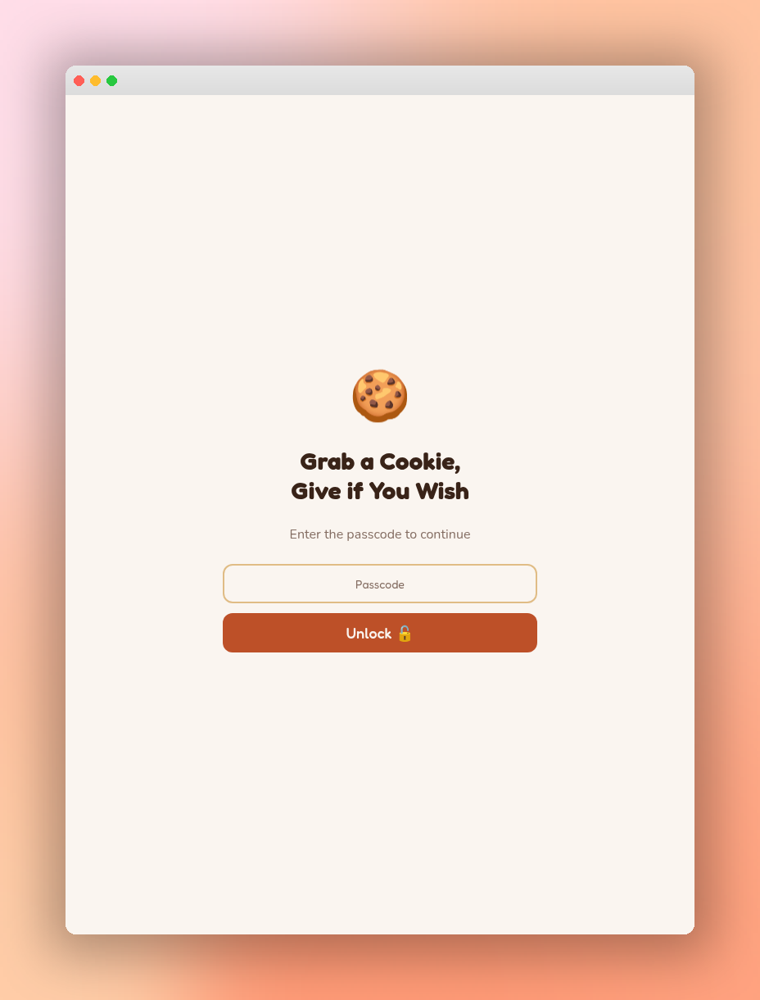
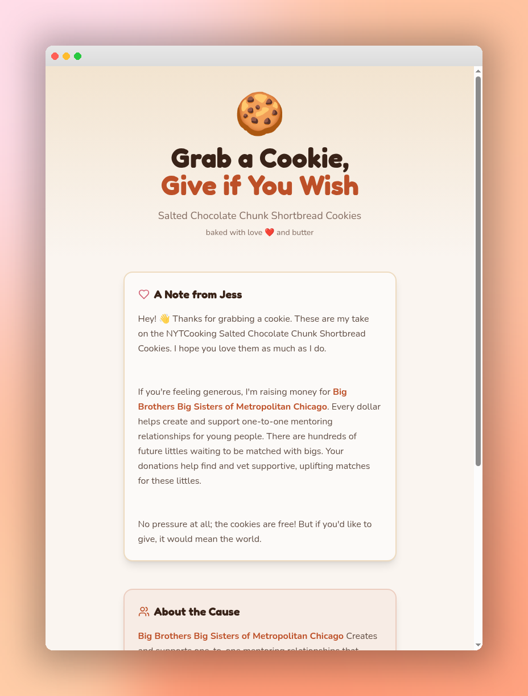
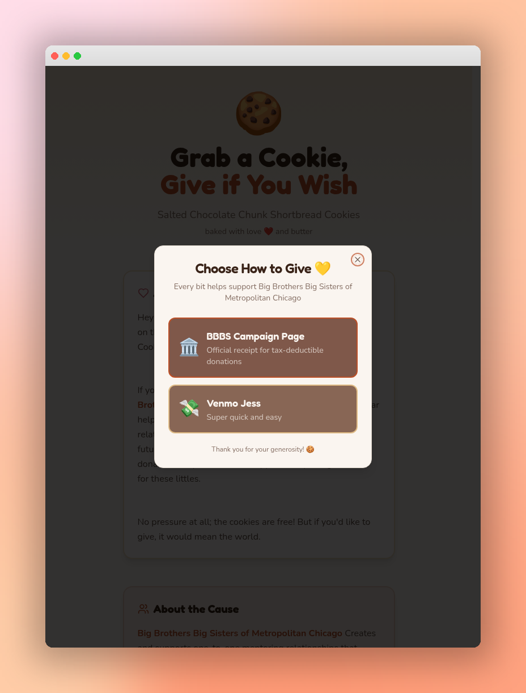
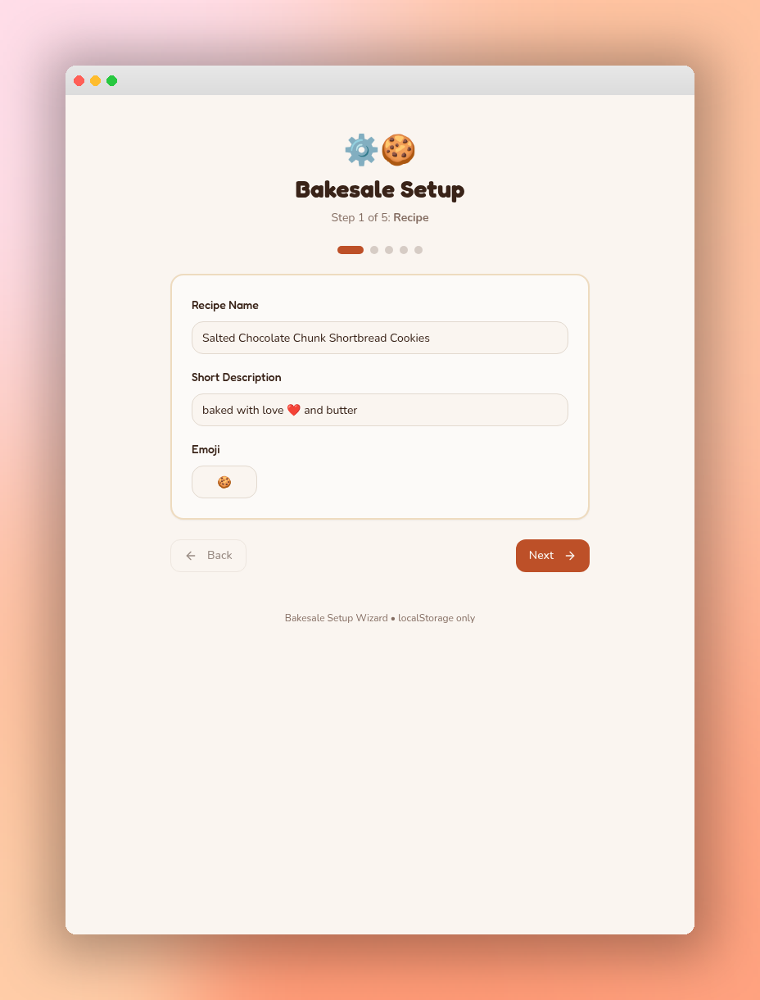

# 🍪 Bakesale Starter Kit

A mobile-first donation page for bake sales and fundraisers. Set up your recipe, cause, and donation links through the admin wizard, then create and share a QR code link with visitors.

# Why I Built This

At my last bakesale, I used the non-profit's donation link to route donations. Unfotunately, the donation flow required adding a credit card, entering an address, contact information, etc. Each donation took roughly 90 seconds, and some folks left because they didn't want to enter all of their personal information, they just wanted a cookie. 

To address this, I made this tool that allows users to choose their donation method: P2P payments for quick and speedy transactions, or the official link if they're looking for a receipt.

## Screenshots

| Landing | Main Page | Donation Modal | Admin Wizard |
|---------|-----------|----------------|--------------|
|  |  |  |  |

## Features

- **Passcode-gated landing page** — visitors scan a QR code or enter a passcode
- **Configurable donation options** — Venmo, PayPal, Zelle, Cash App, Classy, or custom links
- **Admin setup wizard** — step-by-step configuration with live preview link generation
- **Personal message** with bold formatting and line breaks
- **Beneficiary section** with org info and learn-more link
- **localStorage-powered** — no backend required; config lives in the browser
- **Mobile-first design** — warm, cookie-themed UI built with Tailwind CSS

## Quick Start

```sh
# Clone the repo
git clone <YOUR_GIT_URL>
cd bakesale-starter-kit

# Install dependencies
npm install

# Start dev server
npm run dev
```

## Setup

1. Visit `/admin` in your browser (default password: `admin`)
2. Walk through the 5-step wizard:
   - **Recipe** — name, description, emoji
   - **Passcode & Baker** — set the unlock code and your name
   - **Personal Message** — write your note (supports **bold** and line breaks)
   - **Beneficiary** — organization name, description, and link
   - **Donation Options** — add Venmo, PayPal, Classy, etc.
3. Click **Save & Generate Link** to get your shareable URL
4. Point a QR code to that URL — visitors enter the passcode and see your page!

## Tech Stack

- [React](https://react.dev) + [TypeScript](https://typescriptlang.org)
- [Vite](https://vitejs.dev) for fast builds
- [Tailwind CSS](https://tailwindcss.com) for styling
- [shadcn/ui](https://ui.shadcn.com) for UI components
- localStorage for configuration persistence

## Customization

All default content lives in `src/lib/bakesale-config.ts`. Edit `DEFAULT_CONFIG` to change the defaults, or use the admin wizard at runtime.

The color theme is defined in `src/index.css` using CSS custom properties — tweak `--primary`, `--secondary`, `--accent`, etc. to match your vibe.

## Deployment

Deploy anywhere that hosts static sites:

- **[Lovable](https://lovable.dev)** — click Share → Publish
- **Vercel / Netlify** — connect your repo and deploy
- **GitHub Pages** — build with `npm run build` and serve the `dist` folder

## License

MIT
